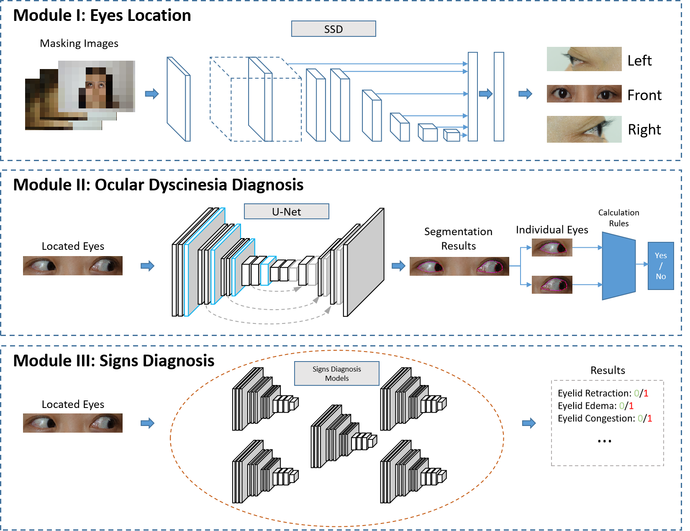
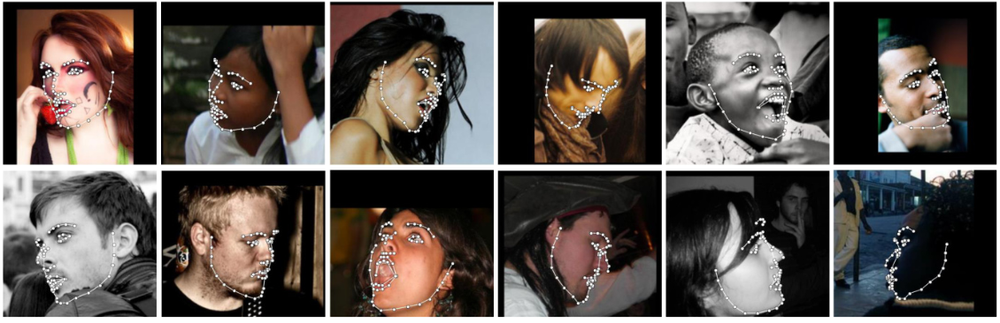

# TAO_Diagnosis




This is an official Pytorch implementation of the paper *"An Intelligent Diagnostic System for Thyroid-Associated Ophthalmopathy based on Facial Images"*. The whole system consists of three main modules.

&#x2753 It should be noted that you need to prepare your own data following the given instructions below.

## 0. Installation
1. Python3
2. PyTorch 1.0 or higher
3. yacs
4. Vizer
5. GCC >= 4.9
6. OpenCV


## 1. Eyes Location

There are three ways to locate the areas of eyes.

### SSD
You can train a Single Shot MultiBox Detector from your own raw data. Our codes are highly based on this [repository](https://github.com/lufficc/SSD). You can follow it for more training details. The advantage of training from the raw data could be good generalization to your envoriments.

Specificially, we have pre-processed the data and corresponding annotations into a [COCO](https://cocodataset.org/)-like format, which should be:
```
COCO_ROOT
|__ annotations
    |_ instances_valminusminival2014.json
    |_ instances_minival2014.json
    |_ instances_train2014.json
    |_ instances_val2014.json
    |_ ...
|__ train2014
    |_ <im-1-name>.jpg
    |_ ...
    |_ <im-N-name>.jpg
|__ val2014
    |_ <im-1-name>.jpg
    |_ ...
    |_ <im-N-name>.jpg
|__ ...
```
, or you can re-write the dataloader according to your data format.

```
@misc{lufficc2018ssd,
    author = {Congcong Li},
    title = {{High quality, fast, modular reference implementation of SSD in PyTorch}},
    year = {2018},
    howpublished = {\url{https://github.com/lufficc/SSD}}
}
```

### DL-based face alignment
We also recommend the well pre-trained deep learning-based [face detectors](https://github.com/1adrianb/face-alignment). The advantage of using a pre-trained DL-based model can be the good generalization under many complex scenarios. It is easy to use and the locations of eyes can be extracted:



```python
import face_alignment
from skimage import io

fa = face_alignment.FaceAlignment(face_alignment.LandmarksType._3D, flip_input=False)

input = io.imread('../test/assets/aflw-test.jpg')
preds = fa.get_landmarks(input)
```

### OpenCV
You can also use the naive OpenCV packages:

```python
import cv2
face_xml = cv2.CascadeClassifier('haarcascade_frontalface_default.xml')
eye_xml = cv2.CascadeClassifier('haarcascade_eye.xml')
img = cv2.imread('face.jpg')
cv2.imshow('src', img)
gray = cv2.cvtColor(img, cv2.COLOR_BGR2GRAY)
```

DL-based method may take more longer time especially in a CPU envoriment. Using OpenCV can speed up this process with a little loss of precision.

## 2. Biomarkers Segmentation
In the second module, we aim to segment some important biomarkers such as corneal and scleral. In this study, we adopt [U-Net](https://github.com/LeeJunHyun/Image_Segmentation) as our segmentation framework. Our codes are mainly based on this [repository](https://github.com/LeeJunHyun/Image_Segmentation).

Replace your data here:
```
data_path='../TAO/dataset/'
GT_path='../TAO/dataset/'
```

**Important ! !**  To prepare you own data, you need to give the pixel-wise annotations on the outputs of the Module I or you may lose some details.

## 3. Disgnosis of Signs
For the diagnosis of signs, we provided a simple demo in this repository. 
We re-write the dataloader. If you get a *.csv* file with image name and corresponding annotations like this:
|name|GT|
|---|---|
|1.jpg|0|
|2.jpg|1|
|3.jpg|1|
|4.jpg|0|
|5.jpg|0|
|...|...|

you can prepare your own raw data following this instruction:
``` python
import os
import numpy as np
# read the file names and their corresponding signs.

sign = 'chemosis'
dict_gt = {}
with open('./signs_%s.csv' %sign) as f:
  txt = f.readlines()

# create the dict to store the annotations.
all_samples = []

for line in txt[1:]:
  line = line.strip('\n').split(',)
  name = line[0]
  label = int(line[1])
  dict_gt[name] = label
  all_samples.append(name)

#split your data, e.g., random
train_samples = all_samples[:int(ratio*len(all_samples))]
valid_samples = all_samples[int(ratio*len(all_samples)):]

#save the .npy files.
np.save('train_samples_%s.npy' %sign, train_samples)
np.save('test_samples_%s.npy' %sign, valid_samples)
np.save('dic_%s.npy' %sign, dict_gt)
```

Then you can place the saved *.npy* into the corresponding folder and run the *run.sh*.

